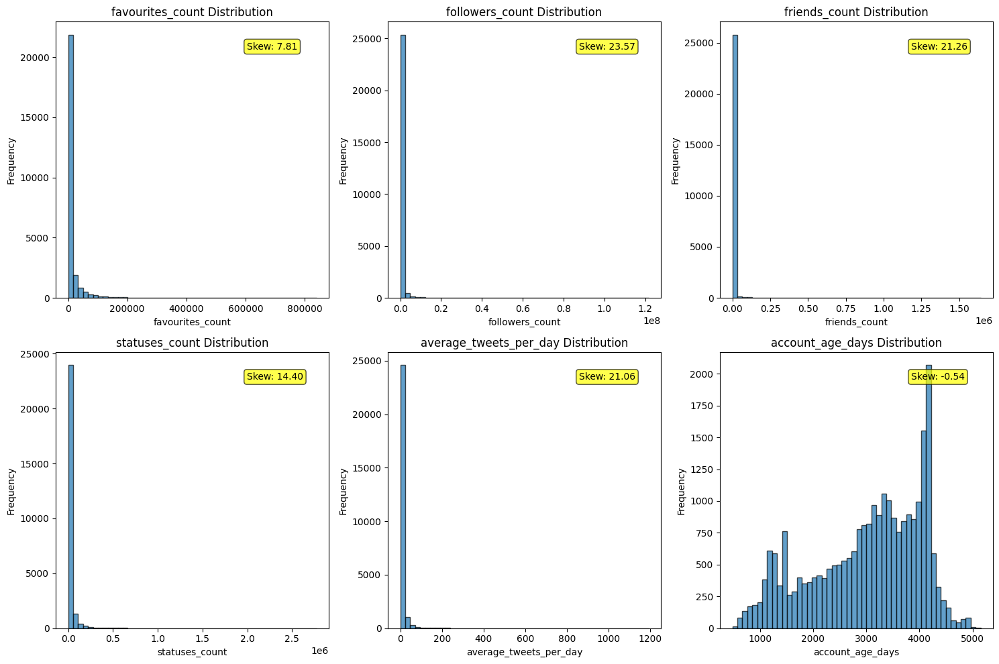
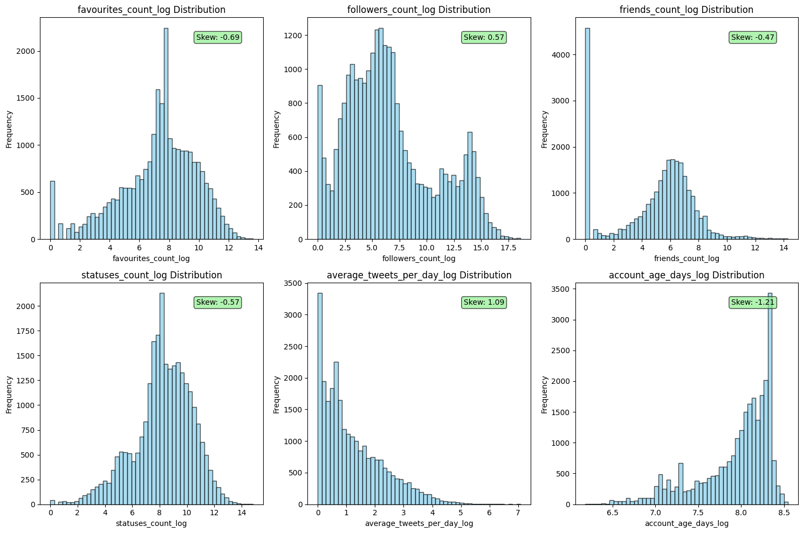
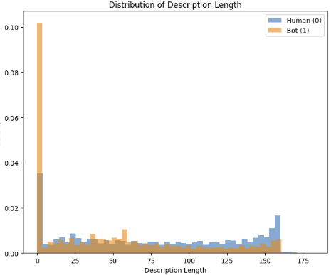
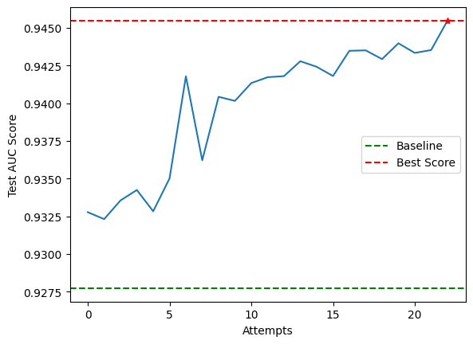

# 1. Introduction

This competition focuses on creating a machine-learning model to distinguish Bot users from genuine
users based on a given dataset of Twitter accounts. Bot Twitter accounts are hard to distinguish simply
based on observation as they are able to mimic genuine accounts with similar usernames, descriptions
and Twitter following. These Bot accounts could commit ad fraud which would lead to wasted marketing
budgets, inaccurate performance metrics for marketers, fake engagement and fraudulent clicks.

The high-level approach is to be able to classify whether the account is a Bot account through a Machine
Learning pipeline with high confidence. My key strategies include iteratively testing different model
architectures, data processing and feature engineering to achieve the best Area Under the Receiver
Operating Characteristic (AUC ROC) score. Some highlight strategies include feature engineering by
fine-tuning a Large Language Model to provide probabilities of whether the account is a Bot account
based on the categorical features, as well as using an ensemble architecture. The dataset given consists
of 19 features with a mixture of categorical and numerical features (see Appendix A for table).

The following pipeline and methodology allowed me to place first in the Kaggle competition amongst 117 other competitors.

# 2. Methodology

## 2.1 Data preprocessing and feature engineering

**Data Preprocessing**
Exploratory Data Analysis (EDA) reveals that most of the numerical features suffer from extreme
skewness. To address this, a log transformation was applied onto the numerical features and appended to
the dataframe (see Appendix B for graph).

Ultimately, I settled on an ensemble approach using XGBoost, CatBoost and LightGBM. The process of
reaching this architecture will be explained in the later parts, but indicated here first as the preceding data
preprocessing steps are specific to ensure the compatibility with the model.

XGBoost and LightGBM require all features to be in numerical form, so further processing of categorical
features was required. Firstly, boolean features (see Appendix A for table) were converted to
corresponding binary features. Secondly, 'lang', 'location' features had to be OneHotEncoded (OHE).
Missing values were replaced with an “unknown” category. EDA shows high cardinality of both features,
with ‘lang’ having 48 unique features and ‘location’ having 8884 unique features. Further analysis shows
that 99.15% and 45.64% of all rows are captured in the top 30 categories of ‘lang’ and ‘location’
respectively (see Appendix C for table). Hence a threshold of 30 categories were chosen. I acknowledge
the lack of representation of categories for the ‘location’ feature and will address this with feature
engineering. Other encoding methods were explored such as LabelEncoding and TargetEncoding, but
produced poorer results. Next, the feature names undergo sanitisation, such as replacing special
character, spaces, consecutive underscores and leading/trailing whitespaces with underscores for
compatibility with LightGBM. Finally, the processed features are dropped from the dataframes.
‘created_at’, ‘profile_image_url’ ‘profile_background_image_url’ is dropped as ‘account_age_days’,
‘default_profile’ and ‘default_profile_image’ captures those information. ‘screen_name’ and ‘id’ were
dropped to reduce noise.

CatBoost can directly process categorical features, so a separate dataframe was created that does not go
through binary encoding and OHE. ‘created_at’, ‘profile_image_url’, ‘profile_background_image_url’,
‘screen_name’ and ‘id’ were dropped from the dataframe for the aforementioned reasons.

To take advantage of built-in missing data handling and XGBoost, CatBoost and LightGBM, the missing
values from the dataset were not dealt with. Furthermore, since all three models are tree-based models,
they are naturally robust to outliers, so no outlier handling was considered. Scaling is not applied on the
numerical features for the same reason.

**Feature Engineering**
EDA on the training data shows that more Bot accounts do not have descriptions compared to genuine
accounts (see Appendix D for graph). To capture this behavior, a binary feature to indicate whether that
account has a description as well as a feature that indicates the length of the description were added to
capture this behavior.

Domain specific features were added, including but not limited to: Network (log value of friend count
multiplied by log value of follower count) and average favourites per tweets (log value of favourite count
divided by log value of statuses count). These features help capture meaningful patterns in user behavior
and engagement that generic features might miss, enabling the model to better distinguish between
different user types or predict target outcomes with improved accuracy.

The dataset was also enriched with 2 features that were the outputs of fine-tuned LLMs. This idea came
from the intuition that LLMs can be leveraged to understand the semantic meaning of ‘description’.
‘bot_prob_from_desc’ is a feature produced by fine-tuning DistilBERT from HuggingFace on the
‘description’ feature using 5-fold cross-validation. Each fold contains a new binary classification model (by
adding a classification head to the model) that generates Bot probability predictions on the validation and
test set, with final test predictions averaged across all 5 folds to create an ensemble Bot probability score.
The idea for this feature came from the concern that the ‘lang’ and ‘location’ features were not
represented enough from OHE. ‘bot_desc_from_cat’ is the same implementation of the previous feature,
except a json object containing ‘description’, ‘lang’, ‘location’ and ‘screen_name’ (in this order) was
passed to the LLM for training. These 2 fine-tuned model features were separately generated and
appended to the dataset in the feature engineering step. These features helped improve AUC ROC
scores significantly.

## 2.2 Model Development and Validation

The final models selected were XGBoost, CatBoost and LightGBM. A soft voting ensemble architecture
was implemented. Since the data was already split into train and test, the train dataset was further split
into test and validation data in an 80-20 split during the iterative testing phase. This data is passed to
the three models for training. The final ensemble prediction will be calculated by averaging the
probabilities from each model before producing a final binary prediction. During the averaging
calculations, more weight (XGBoost: CatBoost: LightGBM = 2:1:1) was given to the XGBoost model as it
produced the best AUC scores. In the final run of the pipeline, the models were given the full training
dataset (instead of only 80% of the train dataset after train and validation split). This version of the
pipeline is the version in the notebook that was submitted.

Hyperparameter tuning in the form of GridSearch was conducted on XGBoost and CatBoost models with
each model having their own parameter grid. Both grids are uniform with a cardinality of 2 to balance between performance and training speed and were executed with a 5-fold cross validation that was
sampled using StratifiedKFold to maintain class proportions. Additionally, hyperparameter tuning when
fine tuning the LLMs was also conducted. This involved manually tuning the training epochs, warmup
steps and learning rate. Different models from HuggingFace were also tested, including a RoBERTa-base
model made for sentiment analysis trained on tweets. Eventually, DistilBERT produced the best AUC
results when integrated with the main pipeline despite taking shorter to fine-tune.

To ensure models are not overfitted, ‘reg_alpha’ and ‘reg_lambda’ parameters were included in the
Gridsearch for XGBoost and ‘l2_leaf_reg’ for CatBoost. Furthermore, AUC scores between train and
validation datasets were closely monitored to ensure that excessive divergence was not present. In
addition, a good indicator that the model is not overfitted is to monitor submissions AUC scores, as this
informs us how well the model is performing on an unseen test dataset.

Efforts to address class imbalance included synthetic oversampling using SMOTE and ADASYN as well
as class weighting with scale_pos_weight, all of which surprisingly produced poorer results. An
explanation for this could be that the interpolation of features by these methods added noise to the data
by creating samples that do not reflect real bot behaviour. Furthermore, the gradient boosting tree-based
models used in the stack are robust to imbalance and optimise imbalance-agnostic metrics like logloss.

My evaluation approach involved using MLFlow to track AUC, accuracy, precision, recall and F1 scores
for each training run and comparing them. The changes for each run was documented and the code
executed was saved as an artifact for reference.

## 2.3 Model Exploration and Final Strategy

Single model architectures were explored, such as Linear Regression and Neural Networks, but through
iterative testing of model types, the final model choice was narrowed down to tree-based models. Further
testing with ensemble architectures produced better results, so ensemble architectures were adopted.

Firstly, different combinations of models were tested. With the goal to increase generalisability of the final
model, diverse models were initially selected, with an ensemble of Logistic Regression, Random Forest
and XGBoost being selected. Upon producing disappointing AUC results, I pivoted to using an ensemble
of three tree-based models, namely XGBoost, CatBoost and LightGBM. XGBoost consistently produced
good results alone, so it was retained. Given the high cardinality of the categorical features, CatBoost was
selected next for its ability to handle categorical variables natively without encoding. Finally, LightGBM
was chosen for its computational efficiency and leaf-wise tree growth, which provides a complementary
learning approach to XGBoost’s level-wise splitting. This stack performed much better and was selected
as the final stack. Stacking ensemble architecture with various meta models were tested, but produced
poorer results than the ensemble architecture.

# 3. Results and Discussion

The final test AUC score of (see Appendix E for table) shows a 0.01774 (1.91%) improvement over
baseline (0.92773) and 0.0127 (1.90%) improvement over my first submission (0.93277) (see Appendix F
for graph). Some strengths of my model include the rich feature engineering brought about by leveraging
LLMs to extract semantic meaning from the categorical features. The strong AUC score indicates that this
model can detect bots accurately and the small gap between validation and test set (0.00883) shows that
the model is reasonably general. As for limitations, the categorical feature encoding could be handled in a
more sophisticated way. The Recall score indicates that this model is missing about 21% of actual bots, and can be seen to be biased towards Precision. This means the model is more focused on producing
fewer false alarms (banning genuine users) than catching all bots. This model behavior can be traced to
the classification threshold being 0.5. Depending on the trade off between the cost incurred when bots are
allowed to slip through and frustration from users getting falsely banned, the Recall-Precision balance can
be adjusted.

# 4. Conclusion and Reflection

My main takeaways from this project is to start simple and be creative when building ML pipelines.
Something that worked well for me was starting with a clean and robust base pipeline as it will serve as a
boilerplate to build and iterate on. I also learnt to not be constrained by best practices and to just try
alternative methodologies as every dataset is different and requires different processing. Sometimes I
would get caught up and would stubbornly proceed in one direction, which slowed me down. For
example, I initially decided not to use OHE to encode the categorical features, which led me to stick with
other encoding methods. This unknowingly produced inferior results, and it was not until I took a step
back to reevaluate my assumptions and methods that I found that OHE actually produced better results.
Through building this pipeline, I have come to realise the cat-and-mouse nature of AI driven fraud. While
we are feature engineering to detect bots, it is very likely that these bots are also studying what features
we are looking out for in order to evade them. In this sense, fraud detection is less about building the
perfect model to catch all bots, but rather to maintain pressure on the bots themselves to continually
adapt.

# 5. Appendix

## Appendix A

Features of the dataset

| Feature name                 | Description                                                                                   | Datatype              |
| ---------------------------- | --------------------------------------------------------------------------------------------- | --------------------- |
| created_at                   | The date and time when the Twitter account was created.                                       | numerical (datetime)  |
| default_profile              | Indicates whether the user has a default profile settings                                     | categorical (boolean) |
| default_profile_image        | Indicates whether the user has a default profile image.                                       | categorical (boolean) |
| description                  | The user's profile description or bio.                                                        | categorical (string)  |
| favourites_count             | The number of tweets the user has liked.                                                      | numerical (integer)   |
| followers_count              | The number of followers the user has.                                                         | numerical (integer)   |
| friends_count                | The number of accounts the user is following.                                                 | numerical (integer)   |
| geo_enabled                  | Indicates whether the user has enabled location services.                                     | categorical (boolean) |
| id                           | The unique identifier for the Twitter account.                                                | numerical (integer)   |
| lang (object)                | The language preference set for the account.                                                  | categorical (string)  |
| location (object)            | The location information provided by the user.                                                | categorical (string)  |
| profile_background_image_url | URL of the user's profile background image.                                                   | categorical (string)  |
| profile_image_url            | URL of the user's profile image.                                                              | categorical (string)  |
| screen_name                  | The user's Twitter handle or username.                                                        | categorical (string)  |
| statuses_count               | The total number of tweets posted by the user.                                                | numerical (integer)   |
| verified                     | Indicates whether the account is verified by Twitter.                                         | categorical (boolean) |
| average_tweets_per_day       | The average number of tweets posted per day.                                                  | numerical (integer)   |
| account_age_days             | The age of the account in days.                                                               | numerical (integer)   |
| target                       | The classification label indicating whether the account is a bot or not. 1 means it is a bot. | numerical (integer)   |

## Appendix B

Dark blue histogram shows before log-transformation and light blue shows after

---

## Appendix C

Percentage rows covered by top N categories for 'lang' and 'location'

|                    | Feature                    |                                |
| ------------------ | -------------------------- | ------------------------------ |
| Categories Covered | lang % of Rows captured | location % of Rows captured |
| 5                  | 85.27                      | 38.73                          |
| 10                 | 91.31                      | 40.85                          |
| 15                 | 94.40                      | 42.37                          |
| 20                 | 96.61                      | 43.62                          |
| 25                 | 98.26                      | 44.70                          |
| **30**             | **99.15**                  | **45.64**                      |
| 35                 | 99.62                      | 46.42                          |
| 40                 | 99.86                      | 47.13                          |
| 48                 | 100.00                     | 48.15                          |

## Appendix D

Distribution of description length for Bot and human accounts

---

## Appendix E

Evaluation metrics of final model

| Metric    | Train dataset score | Validation dataset score | Test (Kaggle) dataset score |
| --------- | ------------------- | ------------------------ | --------------------------- |
| AUC       | 0.9789              | 0.9528                   | 0.94547                     |
| Accuracy  | 0.9287              | 0.8932                   | -                           |
| Precision | 0.9348              | 0.8800                   | -                           |
| Recall    | 0.8464              | 0.7888                   | -                           |
| F1        | 0.8884              | 0.8319                   | -                           |

## Appendix F

Model improvement over attempts

