# 1\. Problem Statement

Bitcoin and cryptocurrencies create an ideal environment for fraudulent activity due to pseudonymity \(transactions are linked to wallet addresses rather than real identities\) and decentralisation \(no central authority to intervene in suspicious transactions\)\. The scale of this problem is rapidly growing\. FinCen reported $700M\+ in Bitcoin\-related losses between 2011\-2021 \(Sigalos, 2022\), while cryptocurrency crime surged 46% year\-over\-year with illicit transaction volume reaching approximately $20 billion in 2022 \(Chainalysis, 2025\)\. As criminals continuously develop sophisticated fraud techniques, effective fraud detection in this field has become increasingly critical\. 

This project aims to develop a machine learning pipeline to __predict fraudulent Bitcoin transactions__ by evaluating and comparing graph\-based methods against traditional machine learning classification algorithms\. The Bitcoin blockchain naturally maps to a directed graph where addresses act as nodes and transactions create directed edges, enabling the application of graph neural networks \(GNNs\) that leverage such network topology\. Graph\-based methods leverage homophily, the tendency for fraudulent entities to interact with other fraudulent entities, to improve classification performance by recognising that fraud risk is influenced by its neighbours, potentially identifying suspicious patterns that traditional feature\-based methods may miss\.  By comparing GNN performance against conventional classifiers like XGBoost, we assess whether relational information provides tangible improvements in fraud detection and operational effectiveness\.

# 2\. Dataset Overview

We used the Elliptic Bitcoin Transaction Graph dataset, which is a collection of anonymized Bitcoin transactions collected over a 2 year period from 2016 \- 2017\. The dataset is retrieved from[ Kaggle: Link to downloaded dataset](https://www.kaggle.com/datasets/ellipticco/elliptic-data-set)\. It comprises three components: a __transactions dataset__ containing anonymized records of individual Bitcoin transactions, an __edge list dataset__ providing information on the directed edges between transactions and a  __classes dataset__ that provide the labels for each transaction \(0 = Unknown, 1 = licit, 2 = illicit\)\.

The Elliptic Bitcoin Dataset consists of __203,769 transactions__ \- __4,545 illicit__ \(2\.23%\), __42,019 licit__  \(20\.62%\), and __157,205 unknown__ \(77\.15%\), represented by a __167\-dimensional__ feature matrix\. The feature set is divided into two distinct components \- 94 local features capturing individual transaction characteristics, and 71 aggregated features representing the statistical properties of 1\-hop neighbor transactions, providing information at both the individual transaction level and the neighborhood level\. Transaction labeling follows a sender\-based methodology, where a transaction is classified as illicit only if the entity controlling the input addresses \(the sender\) is illicit, regardless of the receiver's status \(Asiri, 2025\)\. The dataset exhibits a temporal structure spanning 49 timesteps over approximately two years, with each timestep being collected at 2 week intervals, for a period of 3 hours each time\. Transactions within each timestep form a single weakly connected component through the edgelist network\. No edges exist between timesteps, resulting in 49 isolated graph components rather than a single unified network\. 

The severe class imbalance in our dataset mirrors the operational reality of financial crime detection, where confirmed criminal activity constitutes only a tiny fraction of all network activity and most transactions lack definitive ground\-truth labels\. While the dataset’s 1:9 ratio of illicit to licit transactions is substantially higher than the actual real\-world ratio of 1:700 \(Chainanalysis, 2025\), it still presents a valuable testbed for developing and benchmarking anomaly detection models\. While we know features are grouped into local and aggregated categories, the specific meaning of individual columns is undisclosed, limiting our ability to engineer new features or interpret model decisions\. This design choice prioritises privacy protection for real\-world Bitcoin users while maintaining analytical utility through preserved statistical relationships\. 

To further aid our analysis, we utilised an additional [Deanonymized Elliptic Dataset](https://www.kaggle.com/datasets/alexbenzik/deanonymized-995-pct-of-elliptic-transactions/data), which provides mappings from anonymised transaction IDs in the original Elliptic dataset to actual transaction hashes on the Bitcoin blockchain\. This de\-anonymisation was performed by a Kaggle user, who meticulously linked 99\.5% of the anonymised transactions to real blockchain transaction hashes by matching metadata and blockchain confirmations \(BenZz, 2025\), as detailed in [this article](https://habr.com/ru/articles/479178/) written by him\. By linking these hashes, the dataset significantly broadens the scope of our project, enabling more direct blockchain validation and integration with external data sources for enhanced forensic and network analysis\.

# 3\. Data Exploration and Preprocessing

## 3\.1 Data Cleaning

Initial analysis revealed that the datasets had no missing values, duplicates or data type mismatches, and thus required no cleaning\.

## 3\.2 Graph Based Exploration

The dataset provides anonymised transaction IDs and an edgelist between transactions, resulting in an unconventional graph structure where nodes represent transactions rather than addresses\. This structure reflects Bitcoin's UTXO model, where transactions can have multiple inputs and outputs, allowing us to trace how Bitcoin flows through transaction chains\. Since all features were anonymized, interpretable statistical analysis was limited, and we chose to focus on graph\-based exploration, examining connectivity patterns, chain lengths, homophily, degree distributions, and community structures\.

Chain Length and Connectedness Analysis

We analysed the network's connectivity structure to understand information flow patterns\. The graph contains __203,769 nodes__ and __234,355 edges__, organised into 49 weakly connected components\. The largest component contains only 7,880 nodes \(3\.87%\)\. Within the largest component, the average shortest path length is __9\.55 hops__ \(maximum: 78 hops\)\. While the graph is highly fragmented across timesteps, the relatively short path lengths within components suggest efficient information propagation is possible within each temporal snapshot\.

Homophily Analysis

Homophily measures the tendency of similar nodes to connect, which is critical for understanding how class labels distribute across the network\. In the context of fraud detection, strong homophily means that illicit transactions tend to connect with other illicit	 transactions, while legitimate transactions connect with other legitimate transactions\. We examined edge type distributions, homophily ratios, assortativity coefficients, and the proportion of same\-class neighbors for each node\. The results revealed strong class\-based clustering\. Out of the labeled edges examined, 33,930 \(92\.64%\) connect two licit transactions, 998 \(2\.72%\) connect two illicit transactions, and only 1,696 \(4\.63%\) cross between licit and illicit classes\. 

The overall __homophily ratio__ is __0\.954__, substantially higher than the expected random homophily of 0\.824 \(Annex 1\.1\)\. The __assortativity coefficient__ is __0\.516 __\(on a scale from \-1 to 1\), indicating strong assortative mixing where similar nodes preferentially connect with each other\. These findings suggest that neighbor labels provide strong predictive signals\. The low proportion of cross\-class edges indicates that illicit transactions remain relatively isolated from legitimate flows, consistent with money laundering patterns where criminals obfuscate funds while maintaining minimal connections to legitimate channels for cash\-out purposes\.

Degree Distribution Analysis

Degree distribution analysis was conducted to reveal whether the network exhibits scale\-free properties common in real\-world networks, identify hub nodes that play disproportionately important roles in information propagation, and determine whether structural features like degree differ systematically between illicit and licit transactions\. The overall degree statistics revealed a sparse network, with mean __in\-degree__ and __out\-degree__ of __1\.15 __each, though maximum values reach __284 __and __472 __respectively, indicating hub nodes \(Annex 1\.2\)\. The estimated power\-law exponent is 2\.69, falling within the typical range of 2 to 3 for scale\-free networks\. Licit transactions have a higher __mean in\-degree__ of __1\.91__ and __out\-degree__ of __1\.19__, while illicit transactions have significantly lower values of __1\.27__ and __0\.74__ respectively\. Among the top 5% highest\-degree nodes, only 0\.7% are illicit compared to 42\.3% licit\. These patterns suggest fraudulent actors maintain lower network profiles, making degree\-based features potentially valuable for classification\.

## 3\.3 Rebalancing / Selective Filtering of Time Steps

We did not apply traditional rebalancing techniques such as oversampling or synthetic data generation\. Creating synthetic transactions would introduce artificial nodes and edges into the network without understanding the actual transaction flow patterns, potentially adding noise that could degrade model performance on the real network structure\. Instead, we addressed the class imbalance by filtering timesteps based on fraud prevalence\. Timesteps with very few fraudulent transactions pose two challenges \- incorrect predictions disproportionately skew performance metrics for that timestep, and that the model is unable to learn meaningful fraud patterns from such sparse examples\. After experimentation, we set a threshold of minimally 25 fraudulent transactions per timestep, filtering out 14 of the 49 timesteps that fell below this threshold \(Annex 2\)\.

## 3\.4 Feature Engineering \- Community Detection

We attempted feature engineering on top of the original feature set, focusing on incorporating graph\-level community structure\. We implemented per\-timestep community detection analysis using the Louvain algorithm and identified 45 potential fraud rings across the dataset, with clear structural signatures distinguishing illicit from licit communities \(Annex 3\.1\)\. Fraud rings exhibited 38% higher density, 33% smaller size, and 75% lower clustering coefficients compared to licit communities \(Annex 3\.2\)\. Based on these findings, we hypothesised that incorporating community\-level features into our models could improve fraud detection by explicitly encoding these structural patterns\. We engineered 10 community\-based features \(Annex 3\.3\), and these features were appended to the original 165\-dimensional feature vector, expanding the input to 175 features\. The enhanced models were trained using the same architecture and hyperparameters as the baseline\. 

| Approach | F1 | PR-AUC | Precision | Recall | ROC-AUC | Accuracy |
|----------|--------|--------|-----------|--------|---------|----------|
| Baseline GCN | 0.4864 | 0.5639 | 0.4106 | 0.5965 | 0.8663 | 0.8719 |
| Baseline XGBoost | 0.8174 | 0.8729 | 0.9588 | 0.7124 | 0.9635 | 0.9676 |
| GCN + Community Features | 0.4887 | 0.5486 | 0.3930 | 0.6458 | 0.8707 | 0.8625 |
| XGBoost + Community Features | 0.8079 | 0.8594 | 0.9447 | 0.7057 | 0.9574 | 0.9659 |

*Figure 1: Model Performance: Baseline VS Community Features*

The community\-enhanced GCN achieved an F1 score of 48\.87%, representing a slight 0\.23 percentage point increase from the baseline GCN \(48\.64%\), while the community\-enhanced XGBoost achieved an F1 score of 80\.79%, representing a 0\.95 percentage point decrease from the baseline XGBoost \(81\.74%\) \(Figure 1\)\. 

This underperformance was insufficient to justify the additional complexity\. Such underperformance could be due to several reasons\. Community structure changed drastically across timesteps\. The 45 identified fraud rings were temporally isolated, with most communities appearing in only one or two timesteps before dissolving\. This lack of persistence meant that the models could not learn stable community patterns applicable to future timesteps\. Furthermore, community features were inherently redundant with the existing 72 aggregated neighbour features \(indices 94\-165\), which already encoded 1\-hop neighbourhood statistics, potentially introducing noise that degraded performance\.

# 4\. Model Methodology

## 4\.1 Model Evaluation Strategy

### 4\.1\.1 80\-20 Temporal Split

In order to reflect realistic real\-world deployment scenarios where models must predict fraud based on historical data, we employed an 80\-20 temporal split for all experiments, where the first 80% of valid timesteps \(28 steps\) were used for training, and the final 20% \(7 steps\) were reserved for testing\. Random splitting was avoided as it artificially inflates performance metrics by allowing the model to learn from transactions that occur after the test period, creating data leakages\. The use of a temporal split is particularly important given the Bitcoin fraud landscape's  tendency for distribution shifts\. As documented by Weber et al\. \(2019\), the dataset contains a significant pattern change at timestep 43, where a major dark market shutdown fundamentally altered fraud patterns\. By testing on future timesteps, our evaluation captures the model's ability to generalise across such distribution shifts, providing a more realistic performance estimate\. This approach also supports the notion that fraud detection systems must continuously adapt to evolving criminal tactics, making temporal robustness a critical requirement\.

### 4\.1\.2 Pooled Test Evaluation

We adopted a pooled test evaluation approach, treating all transactions across the 7 test timesteps as a single unified timestep\. This approach was adopted as it calculates performance metrics at the transaction level rather than averaging metrics across individual timesteps, providing robustness to timestep size variations, which range from approximately 2,500 to 5,600 transactions per step\. Per\-timestep averaging would have given disproportionate weight to smaller timesteps, potentially misrepresenting system performance\. Furthermore, pooled evaluation matches how traditional machine learning models and production systems typically compute metrics, facilitating fair comparisons between models  and enabling direct translation of experimental results to expected deployment performance\.

### 4\.1\.3 Metrics Used for Evaluation

In our imbalanced dataset, traditional metrics can be misleading\. A model classifying all transactions as licit would achieve 90\.2% accuracy despite detecting zero illicit transactions\. Given the imbalance in the dataset, we decided to go with these metrics:

1. __F1 Score__: Harmonic mean of precision and recall, balancing fraud detection effectiveness with operational efficiency\. Used as the primary metric\.
2. __PR\-AUC: __Area under the precision\-recall curve across all thresholds, measuring how well the model maintains precision at varying recall levels\.
3. __Recall on Minority__: Percentage of actual illicit transactions identified which is critical for minimising financial losses\. The minority class is the illicit transactions\. 
4. __Precision__: Percentage of flagged transactions that are genuinely fraudulent, which is important for operational efficiency as each investigation incurs administrative costs\.

We selected F1 as our primary metric for model selection and optimisation because it efficiently balances the objectives of catching fraudsters and maintaining manageable false alarm rates\. We also prioritized PR\-AUC over ROC\-AUC, as it provides a more realistic assessment for imbalanced datasets by focusing on positive class performance rather than being inflated by the large number of true negatives\.

## 4\.2 GCN Pseudo\-labelling

A standout feature of the dataset is the large proportion of unknown labels \(77\.15%\)\. Exploration into leveraging this was explored in the form of pseudo\-labelling\. Pseudo\-labelling involves using a trained model's high\-confidence predictions on unlabeled data to generate artificial labels, which are then added to the training set to iteratively improve model performance\. We explored 3 different implementations of pseudo\-labelling, with each proceeding pipeline being more complex than the previous, and compared their results\. The training and evaluation was implemented in 2 phases\. The first phase, the pseudo\-labelling phase, employs an expanding temporal window strategy across 8 windows \(e\.g\., train on t=1\-10, test on t=11\-15; then train on t=1\-15, test on t=16\-20 etc\), where the model iteratively generates pseudo\-labels for unknown nodes within each training window and accumulates them for subsequent iterations\. The second phase, the final evaluation phase, trains a GCN model on the complete pseudo\-labeled dataset \(timesteps 1\-39\) and evaluates it on a held\-out temporal test set using a 80\-20 temporal split to assess the overall impact of pseudo\-labeling on model performance\.

### 

### 4\.2\.1 Basic Pseudo\-labelling

A straightforward confidence thresholding mechanic was implemented\. Any predicted nodes with prediction confidence exceeding a fixed threshold of 98% were accepted as pseudo\-labels and added to the training set for subsequent iterations\. After training on each temporal window, the model predicts labels for all unknown nodes within that window, and those with softmax probability ≥ 0\.98 for either the illicit or licit class are automatically labeled\. The intuition is that high\-confidence predictions are likely to be correct and can safely augment the training data, allowing the model to leverage the large proportion of unlabeled nodes \(77\.15%\) to improve its learning in subsequent iterations\.

### 4\.2\.2 Class Ratio Maintenance Pseudo\-labelling

This implementation considers the class imbalance by introducing two key constraints\. First, a stricter top\-k selection mechanism where only the top 10% most confident predictions per class are considered as candidates for pseudo\-labeling\. This ensures only the highest\-quality predictions are selected\. Second, a class ratio balancing constraint maintains the original dataset's illicit\-licit distribution \(11:89\) by limiting the number of pseudo\-labels accepted from each class\. The balancing mechanism calculates the maximum allowable pseudo\-labels for each class such that their ratio matches the target\. For example, if 5,000 licit candidates are selected, only approximately 619 illicit candidates \(11% of the total\) would be accepted to maintain the 1:9\.2 ratio\. This dual\-constraint approach ensures that pseudo\-labels are both high\-confidence and representative of the true class distribution, preventing the model from over\-representing the majority class\. This stricter implementation should mitigate error propagation from incorrect pseudo\-labels and prevent the model from becoming biased towards the majority class\.

### 4\.2\.3 Pseudo\-labelling with Validation Gating

The final implementation employs the strictest constraints, building upon the class\-balanced approach with an additional validation gating mechanism\. At each temporal window, the original labeled data is randomly split 80\-20 into training and validation sets, where the validation set retains only the original ground truth labels\. After generating candidate pseudo\-labels using the top\-10% and class\-balancing constraints from the previous implementation, the model is temporarily retrained with these candidates included, and its F1 score on the validation set is compared to the baseline F1 score \(trained without pseudo\-labels\)\. The pseudo\-labels are only accepted and permanently added to the training set if they improve the validation F1 score\. If they do not improve F1 scores, they are rejected and the original labels are retained\. This gating mechanism acts as a quality control filter that prevents the accumulation of low\-quality pseudo\-labels that might degrade performance\. By only accepting pseudo\-labels that improve performance on held\-out ground truth data, this approach further reduces error propagation from incorrect pseudo\-labels, ensuring that only beneficial augmentations to the training set are retained across iterations\.

### 4\.2\.4 Results Comparison

| Approach | F1 | PR-AUC | Precision | Recall | ROC-AUC | Accuracy |
|----------|--------|--------|-----------|--------|---------|----------|
| Baseline GCN | 0.4864 | 0.5639 | 0.4106 | 0.5965 | 0.8663 | 0.8719 |
| GCN + Pseudo Labelling (PL) | 0.2174 | 0.1174 | 0.1433 | 0.4277 | 0.7699 | 0.8439 |
| GCN + PL + Class Ratio | 0.2355 | 0.1838 | 0.1451 | 0.6242 | 0.8112 | 0.7895 |
| GCN + PL + Val Gating | 0.2611 | 0.2048 | 0.1670 | 0.5975 | 0.8198 | 0.8235 |

*Figure 2: Model Performance in Phase 2 Comparison Table*

As shown in Figure 2, among the 3 PL methods implemented, the most conservative implementation, validation gating, produced better F1, PR\-AUC, ROC and Accuracy scores compared to the other 2 implementations\. This behaviour can be attributed to the validation gating mechanism's ability to reject low\-quality pseudo\-labels that would degrade performance \(Annex 5\.1\), preventing error propagation and the accumulation of incorrect labels that occurred in the other approaches\.  
  
Concerningly, all three implementations produced far poorer results compared to the baseline GCN\. This large disparity in results provided enough evidence to allow us to conclude that pseudo\-labelling does not have any positive benefits on model performance, and hence we did not pursue this approach further\. This can be further evidenced with the fact that the F1, AUC\-ROC, Precision and Recall degraded through each window \(Annex 5\.2\)\. The fundamental approach of leveraging unlabeled data through pseudo\-labels appears to introduce more noise and error propagation than benefits, even with increasingly sophisticated selection and validation mechanisms\.

## 

## 4\.3 Graph Convolutional Networks \(GCN\)

Seeing that the dataset provided an edgelist alongside features, GCNs were a natural choice when selecting models to explore the strong homophily observed in the dataset \(homophily ratio: 0\.954\)\.

| Approach | F1 | PR-AUC | Precision | Recall | ROC-AUC | Accuracy |
|----------|--------|--------|-----------|--------|---------|----------|
| Baseline GCN | 0.4864 | 0.5639 | 0.4106 | 0.5965 | 0.8663 | 0.8719 |
| Sequential GCN | 0.5720 | 0.5944 | 0.5868 | 0.5579 | 0.8671 | 0.9151 |
| Evolve GCN O | 0.3427 | 0.2029 | 0.2323 | 0.6525 | 0.7642 | 0.7454 |

*Figure 3: Model Performance: GCN Variants*

### 4\.3\.1 Baseline GCN

We implemented an architecture consisting of two GCN layers with ReLU activation, followed by a final linear classification layer\. The model employs mean pooling aggregation to combine neighbourhood features, allowing each node to incorporate information from its local graph structure during training, theoretically allowing fraudulent transactions to be identified based on their connections to other fraudulent entities even when individual transaction features appear legitimate\. The baseline GCN was trained using the defined model evaluation strategy mentioned above\. It was trained for 100 epochs using cross entropy loss weighted by class frequency to address the 1:5\.82 illicit\-to\-licit imbalance\. This achieved an F1 score of 48\.64%, with a precision of 41\.06% and recall of 59\.65% \(Figure 3\)\. 

This mediocre performance resulted from the significant distribution shift between training and test periods\. The model learnt to detect fraud patterns that dominated training data but ceased to exist in the test period\. The baseline GCN lacked temporal awareness to adapt to these evolving patterns, prompting us to develop temporally aware GCN approaches\.

### 4\.3\.2 Sequential GCN

The Sequential GCN implements continual learning by progressively training on temporal snapshots of the transaction graph\. Unlike the baseline GCN which trains on all timesteps simultaneously, this approach mimics real\-world deployment where models are updated incrementally as new data arrives\.  
For each timestep t: 

- Construct a graph using only labeled nodes from that timestep
- Fine\-tune the model for 50 epochs on the current timestep's graph
- Model weights persist to the next timestep, allowing for continual adaptation

This model achieved an F1 score of 57\.20%, representing a 8\.56 percentage point improvement over the baseline GCN \(48\.64% F1\) \(Figure 3\)\. This improvement validates our hypothesis that temporal adaptation helps to track evolving fraud patterns rather than relying solely on outdated historical data\. However, the consistently low F1 score revealed that temporal fine tuning alone cannot overcome fundamental structural limitations of graph based methods on this dataset\. 

A key challenge still persisted \- the temporal fragmentation of isolated timesteps, made the model unable to leverage the graph structure to propagate information across time as it relearns graph patterns from scratch at each timestep\.

### 4\.3\.3 EvolutionGCN

To address Sequential GCN's inability to tackle temporal fragmentation, we moved to EvolveGCN that uses recurrent neural networks \(RNN\) to evolve the GCN parameters over time\. Unlike previous GCNs where weights W remain constant, EvolveGCN treats W\_t as a hidden state that evolves via W\_t = GRU\(W\_\{t\-1\}, X\_t\), where X\_t represents the current timestep's graph features\. This recurrent architecture maintains long term memory of historical patterns while incorporating new information, enabling better generalisation across distribution shifts\. We evaluated two variants: EvolveGCN\-O, which evolves weight matrices to capture model evolution trends, and EvolveGCN\-H, which evolves node hidden states to track individual node changes\. Both were trained using the defined model evaluation strategy\. The training process involved:

- Sequentially processing timesteps 1\-28 \(training window\)
- For EvolveGCN\-O: Updating GCN weight matrices via GRU cells at each timestep
- For EvolveGCN\-H: Updating node hidden states via GRU cells while keeping GCN weights fixed
- Evaluating on the pooled test window \(timesteps 29\-35\)

EvolveGCN\-O achieved an F1 score of only 34\.27%, having the worst performance amongst Sequential GCN and baseline GCN \(Figure 3\)\. EvolveGCN\-H’s model essentially broke as its recall was 100%\. This failure inferred that EvolveGCN's temporal mechanisms provide no advantage when graphs are temporally disconnected\. Despite its purpose being built for temporal graphs, EvolveGCN’s failure provided strong evidence that the dataset's structure, not our modeling choices, fundamentally limits graph\-based approaches\. Thus, this shifted our modeling strategy to traditional machine learning approaches\.

## 4\.4 Traditional Machine Learning \- XGBoost

### 4\.4\.1 Baseline Superiority

| Approach | F1 | PR-AUC | Precision | Recall | ROC-AUC | Accuracy |
|----------|--------|--------|-----------|--------|---------|----------|
| Baseline GCN | 0.4864 | 0.5639 | 0.4106 | 0.5965 | 0.8663 | 0.8719 |
| Baseline XGBoost | 0.8174 | 0.8729 | 0.9588 | 0.7124 | 0.9635 | 0.9676 |
| Sequential GCN | 0.5720 | 0.5944 | 0.5868 | 0.5579 | 0.8671 | 0.9151 |
| XGBoost + Feature Selection | 0.8241 | 0.8792 | 0.9626 | 0.7204 | 0.9647 | 0.9687 |
| **XGBoost + Feature Selection (Threshold-optimised)** | **0.8345** | **0.8811** | **0.9813** | **0.6977** | **0.9586** | **0.9679** |

*Figure 4: Final Model Performance Comparison Table*

Following the consistent underperformance of graph\-based approaches on temporal data, we shifted our focus to using XGBoost\. Tree\-based ensemble methods, like XGBoost, are advantageous for temporal fraud detection as they are inherently robust to feature interactions and complex, non\-linear relationships\. They do not depend on graph structure, making them less susceptible to distribution shifts\. We implemented XGBoost using all 165 original features with a temporal 80\-20 split identical to our GCN experiments\. The model was configured with *scale\_pos\_weight* set to 5\.82 to account for the class imbalance ratio \(illicit:licit = 1:5\.82 after filtering\), 100 *estimators*, and default hyperparameters as an initial baseline \(Annex 6\)\. It achieved an F1 score of 81\.74% \(Figure 4\), representing a dramatic improvement over the baseline GCN model \(48\.64% F1\) and providing strong evidence that traditional machine learning methods are superior to graph neural networks for this temporal fraud detection task\.

### 4\.4\.2 Feature Selection

Our feature correlation analysis detected high multicollinearity amongst the features, identifying 124 highly correlated feature pairs exceeding an absolute correlation threshold of 0\.9 \(Annex 4\.2\)\. As such, we hypothesised that feature selection could potentially improve model performance by removing redundant features\. To minimise information loss, we compared the XGBoost feature importance scores for each correlated pair, and removed the feature with lower importance while retaining the more important feature\. The feature selection process identified 94 features as optimal, representing a 43% reduction from the original 165 features\. 

### 4\.4\.3 Model Validation and Optimisation

With the reduced feature set established, we conducted hyperparameter optimisation using GridSearchCV to identify the best model configuration\. We trained a XGBoost model using stratified 5\-fold cross validation\. The hyperparameter grid consisted of 243 combinations \(3^5\) covering five key parameters \- *regularisation alpha*, *regularisation lambda*, *maximum tree depth*, *learning rate*, and *subsample ratio* \(Annex 6\)\. The model also used 100 *estimators* and a *scale\_pos\_weight* of 5\.82\. When evaluated on the test set using the default 0\.5 threshold, the model achieved an F1 score of 82\.41%, representing a 0\.67 percentage point improvement over the baseline \(Figure 4\)\.

The default classification threshold of 0\.5 tends to be suboptimal for imbalanced datasets, where the probability distribution is often skewed towards the majority class\. To find the optimal operating point for the model, we performed a threshold sweep from 0\.05 to 0\.95 in 100 steps, computing F1 score, precision, and recall at each threshold value on the test set predictions\. The optimal threshold was found to be 0\.1773, which was substantially lower than the default\. The model with optimised threshold achieved a F1 score of 83\.45%, representing a 1\.04 percentage point improvement over the model with default threshold \(Figure 4\)\. 

The final best model configuration consists of a 5\-fold cross\-validated XGBoost with 94 features and a classification threshold of 0\.1773, achieving 83\.45% F1\. This represented a 29\.68 percentage point improvement over the best performing GCN variant, which achieved 53\.77% F1\. 

# 

# 

# 5\. Account Level Aggregation

## 5\.1 Data Collection

To enrich the transaction\-level data and enable account\-level analysis, we used the de\-anonymised transaction hashes to extract additional information from the blockchain\.com API\. We extracted the *timestamp, num\_inputs, num\_outputs, input\_addresses, output\_addresses, input\_values, output\_values, total\_input\_btc, total\_output\_btc, fee\_btc *for every transaction\. A key challenge we faced was that given the API rate limit of 50 queries/minute, complete data extraction would require 67 hours\. To accelerate this, we split the queries into four equal chunks that ran simultaneously across team members before combining the outputs\.

## 5\.2 Data Processing

A directed graph was constructed from all unique Bitcoin addresses, where nodes represented addresses and edges represented payment flows\. 19\-dimensional feature vector were then computed for each address by aggregating __transaction\-level statistics__ such as total Bitcoin sent and received,__ transaction structure characteristics__ like average number of inputs and outputs,__ temporal patterns__ spanning the address's first and last appearance, and __graph\-based features__ such as in\-degree and out\-degree representing the number of unique counterparties \(Annex 7\.1\)\. 

Finally, labels for addresses were propagated throughout the network \- since the original labels were on a transaction level, we had to decide on a proxy form of labelling the addresses\. Following the original dataset's methodology where transactions are considered illicit only if the sender is illicit, we labeled all input addresses from illicit transactions as illicit accounts\.

## 5\.3 Exploratory Data Analysis

The data is made up of __823,276 addresses__ and __3,359,159 transactions__, with __11,698 __\(1\.42%\) addresses being illicit,__ 161,150__ being licit and__ 650,428__ being unknown \(Annex 7\.2\)\. 

This was a lot higher than the original dataset which had a total of __203,769 transactions__\. This can be attributed to the nature of Bitcoin transactions, where a single transaction can have many senders and many receivers\. Statistical analysis reveals three key behavioral differences between illicit and licit addresses: 

- __*Temporal Patterns:*__ Only __7\.5%__ of addresses remain active across multiple timesteps, and among these persistent addresses, illicit accounts represent just __0\.2%__ compared to __29\.6%__ licit accounts, indicating that criminals favor burner accounts to evade detection while legitimate users maintain long\-term wallets\. Illicit addresses have significantly shorter activity durations \(__mean: 1\.07__ timesteps\) compared to licit addresses \(__mean: 2\.27__ timesteps\), with 98% of illicit addresses active in only a single timestep\.
- __*Transactions Volume:*__ Illicit addresses transact substantially lower amounts than licit addresses\. For BTC sent, illicit addresses average __2\.53 BTC__ \(median: __1\.06 BTC__\) while licit addresses average __56\.88 BTC__ \(median: __4\.78 BTC__\)\. Similarly, illicit addresses receive an average of __4\.64 BTC__ \(median: __0\.14 BTC__\) compared to licit addresses receiving __59\.44 BTC__ \(median: __0\.00 BTC__\)\. These patterns suggest criminals conduct smaller, more frequent transactions to minimise losses during law enforcement seizures and to fragment transaction trails \(AiPrise, n\.d\.\) \(Annex 7\.3\)*\.*
- __*Fees Behaviour:*__* *Illicit addresses pay 43% higher fees on average \(mean: __0\.032 BTC__, median: __0\.007__ __BTC__\) compared to licit addresses \(mean: __0\.022 BTC__, median:__ 0\.005 BTC__\)\. This premium suggests criminals prioritise transaction speed over cost, using higher fees to ensure faster blockchain confirmation and reduce the window of vulnerability during which funds can be traced or frozen\. All statistical differences were confirmed significant using Mann\-Whitney U tests \(p < 0\.05\), demonstrating that illicit and licit addresses exhibit fundamentally distinct behavioral patterns across temporal, volumetric, and fee dimensions \(Annex 7\.4\)\.

## 5\.4 Visualisations

Network visualisation provides critical value for fraud detection by enabling pattern discovery and investigative workflows that are difficult to achieve through statistical analysis alone\. While machine learning models excel at classification based on learned patterns, visual graph exploration allows analysts to identify emerging fraud schemes, understand transaction flow pathways, and generate hypotheses about criminal network structures that can inform feature engineering and model refinement\. 

A strategic sampling methodology was employed, filtering for 5000 addresses to keep the visualisations manageable\. All fraudulent addresses along with their 1\-hop neighbours were included, capturing the immediate transaction network surrounding illicit activity\. The remaining slots are then filled through random sampling from the rest of the network\. This ensures that illicit nodes and their direct transaction partners are always visible regardless of sample size\. Louvain community detection is applied to identify densely connected clusters of addresses that frequently transact with each other\. 

This visualization approach complements traditional machine learning by enabling analysts to visually identify patterns that might otherwise go unnoticed\. For example, when multiple fraudulent nodes interact with a single unknown node, this convergence pattern becomes immediately apparent and can trigger targeted investigation\.

 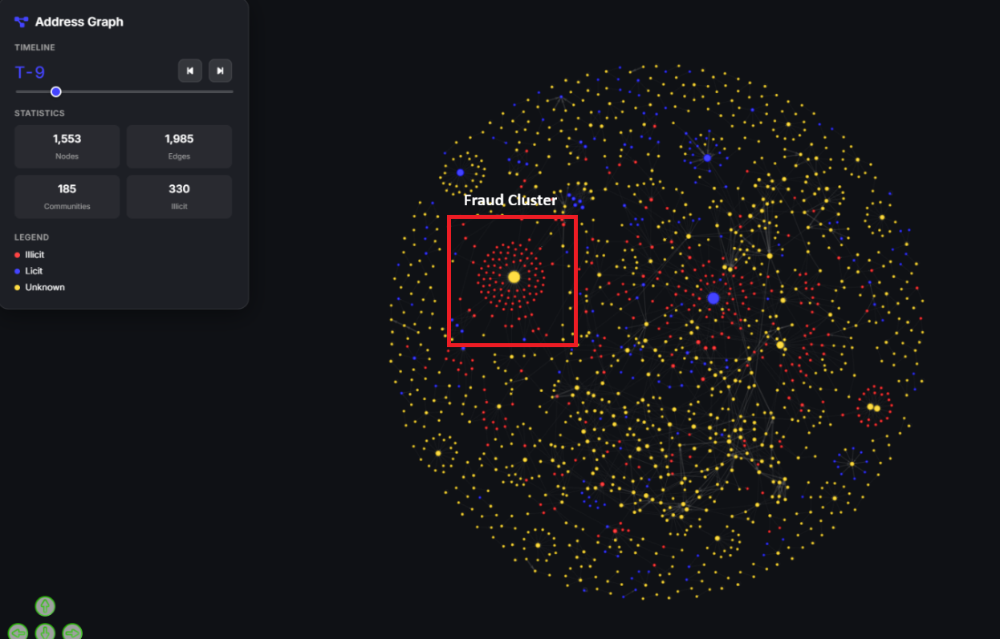

*Figure 5: Visualisation of Timestep 9\. An interactive visualiser built by us can be viewed *[*here*](https://njihin.github.io/bt4012_elliptic/src/graph/visualizations/address_graph_viewer.html)

# 

# 6\. Conclusion

## 6\.1 Project Insights 

Our project evaluated graph\-based and traditional machine learning approaches for Bitcoin fraud detection, revealing several critical findings that challenge conventional assumptions about GNNs' superiority for network\-structured data\. The 80\-20 temporal split provided realistic performance estimates reflective of production deployment, and exposed the fundamental challenge of distribution shifts in fraud detection\. Despite Bitcoin's natural graph structure and strong homophily, XGBoost achieved an F1 score 29\.68% compared to the best GCN variant, demonstrating that tree\-based ensembles' robustness to feature interactions and distribution shifts outweighs the theoretical advantages of leveraging graph topology\. GNNs' reliance on stable neighbourhood patterns made them vulnerable to temporal evolution, while XGBoost's feature\-based approach proved more adaptable\. These findings demonstrate that in fraud detection, model robustness to temporal distribution shifts are more critical than architectural sophistication\. 

Account\-level network visualisation complemented our quantitative analysis by enabling visual pattern discovery\. The visualizations made convergence patterns immediately apparent, where multiple illicit addresses interacting with unknown nodes could trigger targeted investigations \- insights that would be obscured in purely statistical approaches\.

## 6\.2 Limitations

Our project has several limitations\. The dataset's 1:9 illicit\-to\-licit ratio, while challenging, remains far more balanced than real\-world scenarios \(~1:700\)\. Additionally, only 23% of transactions are labelled \(4,545 illicit, 42,019 licit\), with 77% remaining unknown\. These unknown transactions may contain undetected fraud that our models incorrectly learn to classify as legitimate, potentially introducing label noise that degrades performance\. Furthermore, the temporal coverage of our dataset might not be as relevant in today’s age\. It only covers 2016 \- 2017, leaving a 8 year gap from our current analysis\. Bitcoin fraud techniques have evolved significantly since then with new attack vectors including DeFi exploits, NFT scams, and sophisticated mixing services that may not be represented in historical data\.

Feature anonymisation constrained interpretability and domain\-driven feature engineering possibilities\. Our feature importance analysis could only report indices \(e\.g\., feat\_52 is most important\) rather than actionable insights about which transaction characteristics indicate fraud, limiting the practical utility of findings for AML practitioners\. 

The temporal fragmentation that limited GCN performance may not reflect regular blockchain networks, suggesting that graph\-based methods could prove more effective on datasets with persistent cross\-temporal connections\. Modern fraud detection systems operate on continuously evolving networks with more gradual pattern shifts rather than abrupt regime changes\. Graph\-based methods may prove more effective on datasets with persistent cross\-temporal connections and stable community structures, suggesting that our findings should not be overgeneralized to dismiss GNNs for all fraud detection applications\.

## 6\.3 Future Works

Future works should evaluate a multitude of graph\-based models on datasets reflecting more realistic class imbalances to validate robustness in practical settings\. Additionally, researching transfer learning and domain adaptation techniques can help models better generalise to evolving fraud patterns and distribution shifts over time\. 

# 7\. Annex

## 1\. Visualisations on Graph Based Exploration

### 1\.1\. Homophily Patterns

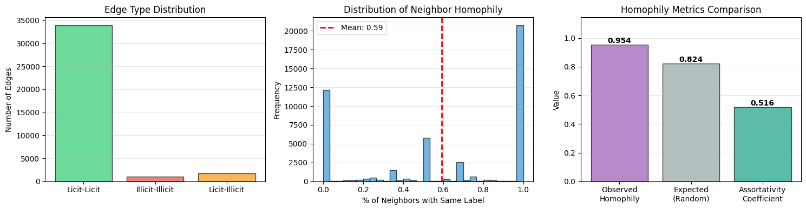

### 1\.2\. Degree Distributions

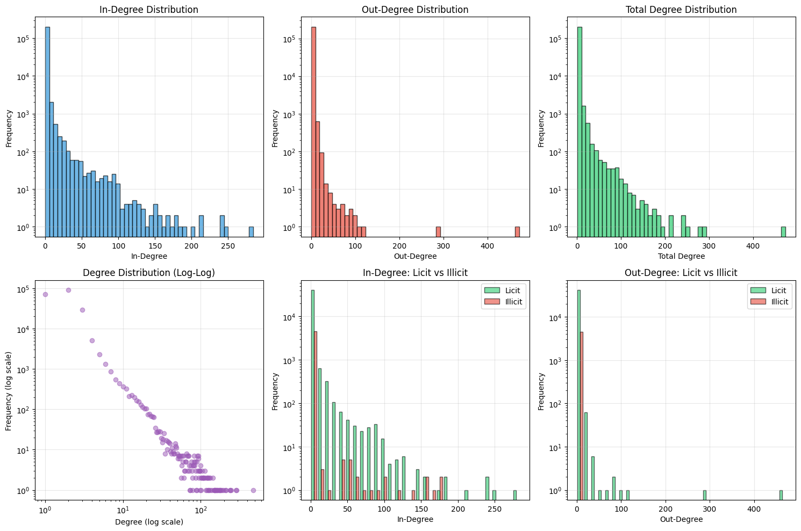

## 2\. Breakdown of Working Timesteps after Selective Filtering

Total Valid Timesteps: 35

Training Steps \(28\): \[4, 7, 8, 9, 11, 13, 14, 15, 16, 17, 18, 19, 20, 21, 22, 23, 24, 25, 26, 28, 29, 30, 31, 32, 34, 35, 36, 37\]

Testing Steps \(7\): \[38, 39, 40, 41, 42, 48, 49\]

## 3\. Visualisations on Community Detection Analysis

### 3\.1\. Change in Community Characteristics Over Time

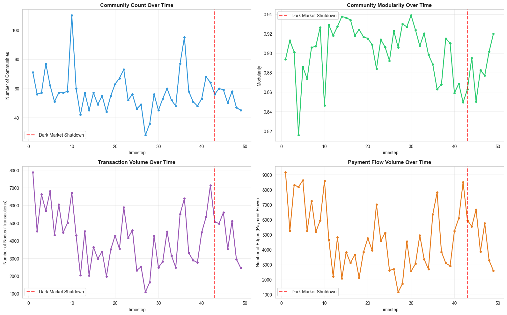

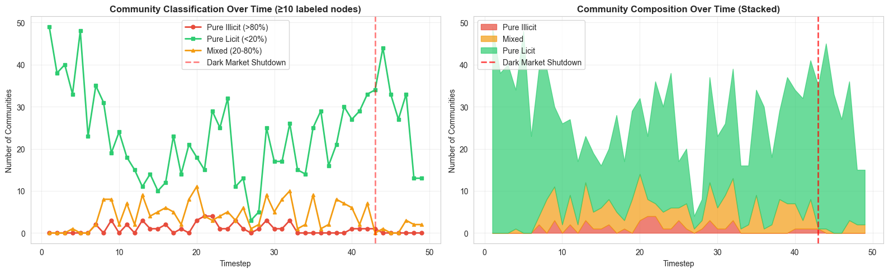

### 3\.2\. Structural Comparison Statistics and Boxplots: Illicit vs Licit

================================================================================

STRUCTURAL COMPARISON: ILLICIT vs LICIT COMMUNITIES

================================================================================

          Metric  Illicit \(Mean\)  Licit \(Mean\)  Illicit \(Median\)  Licit \(Median\)

           size       71\.644444    107\.002609         63\.000000       90\.000000

          edges       71\.755556    114\.852174         63\.000000       91\.000000

        density        0\.019751      0\.014305          0\.016129        0\.011494

     avg\_degree        1\.987433      2\.058287          1\.978947        2\.000000

avg\_path\_length        7\.278497      7\.354868          6\.105263        6\.597449

       diameter       19\.577778     20\.555652         16\.000000       18\.000000

 avg\_clustering        0\.002667      0\.011063          0\.000000        0\.000000

================================================================================

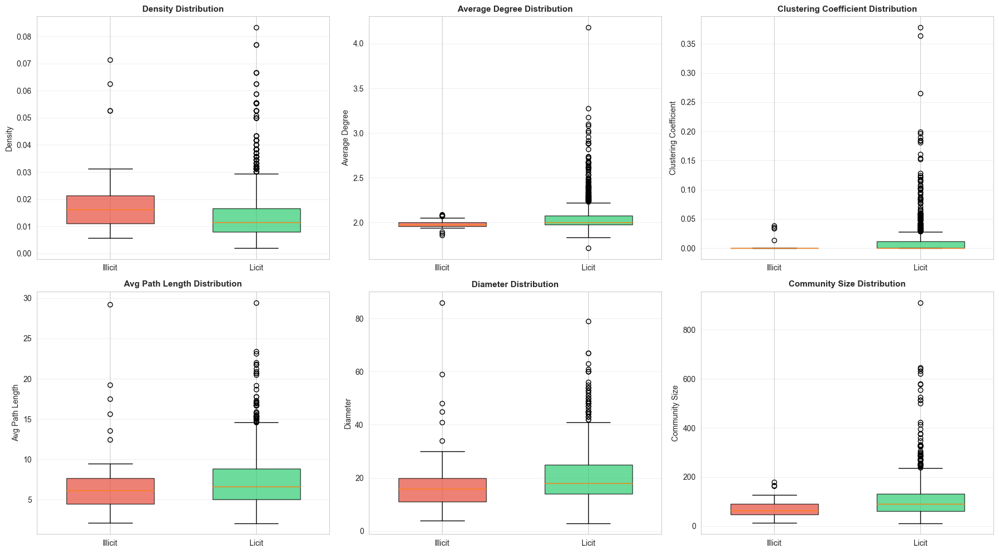

### 3\.3\. List of Community\-based Features

| Index | Feature Name | Description |
|-------|--------------|-------------|
| 167 | community_density_167 | Density of the community (edges / possible edges) |
| 168 | community_size_168 | Number of nodes in the community |
| 169 | community_clustering_169 | Average clustering coefficient of the community |
| 170 | community_unknown_ratio_170 | Ratio of unknown nodes in the community |
| 171 | is_small_dense_community_171 | Binary flag: density > 0.016 AND size < 90 |
| 172 | is_zero_clustering_172 | Binary flag: clustering coefficient == 0.0 |
| 173 | node_betweenness_centrality_173 | Node betweenness centrality within its community |
| 174 | node_degree_centrality_174 | Node degree centrality within its community |
| 175 | community_avg_path_length_175 | Average shortest path length in the community |
| 176 | community_diameter_176 | Diameter (longest shortest path) of the community |

## 4\. Feature Selection

### 4\.1\. List of Top 30 Most Important Features by XGBoost

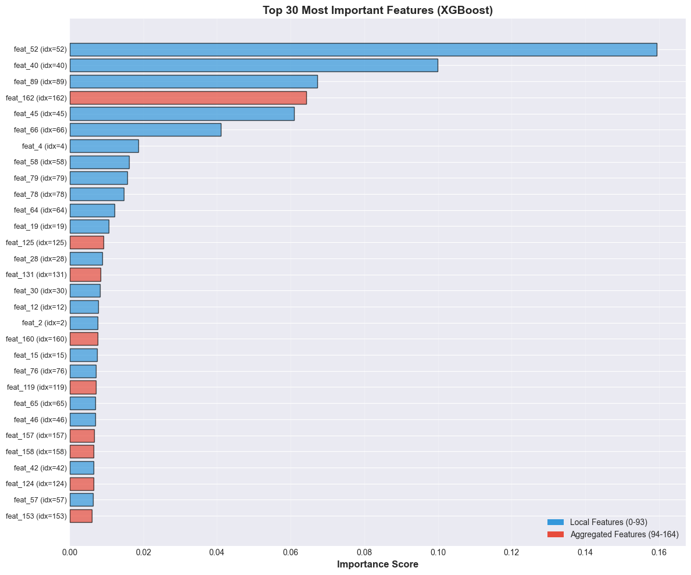

### 4\.2\. Statistics from Feature Correlation Analysis

Highly Correlated Feature Pairs \(|r| > 0\.9\): 124

__Top 20 Most Correlated Pairs__

| Feature_1_Name | Feature_2_Name | Correlation |
|----------------|----------------|-------------|
| feat_23 | feat_29 | 1.000000 |
| feat_4 | feat_13 | 1.000000 |
| feat_58 | feat_64 | 1.000000 |
| feat_22 | feat_28 | 1.000000 |
| feat_59 | feat_65 | 1.000000 |
| feat_60 | feat_66 | 1.000000 |
| feat_24 | feat_30 | 1.000000 |
| feat_21 | feat_27 | 0.999999 |
| feat_57 | feat_63 | 0.999979 |
| feat_151 | feat_152 | 0.998999 |
| feat_33 | feat_36 | 0.998928 |
| feat_25 | feat_31 | 0.998649 |
| feat_26 | feat_32 | 0.998601 |
| feat_34 | feat_36 | 0.998073 |
| feat_61 | feat_67 | 0.997104 |
| feat_62 | feat_68 | 0.996921 |
| feat_73 | feat_74 | 0.996422 |
| feat_115 | feat_116 | 0.995270 |
| feat_157 | feat_158 | 0.995191 |
| feat_71 | feat_72 | 0.995183 |

### 4\.3\. Correlation Heatmap of Top 30 Most Important Features by XGBoost

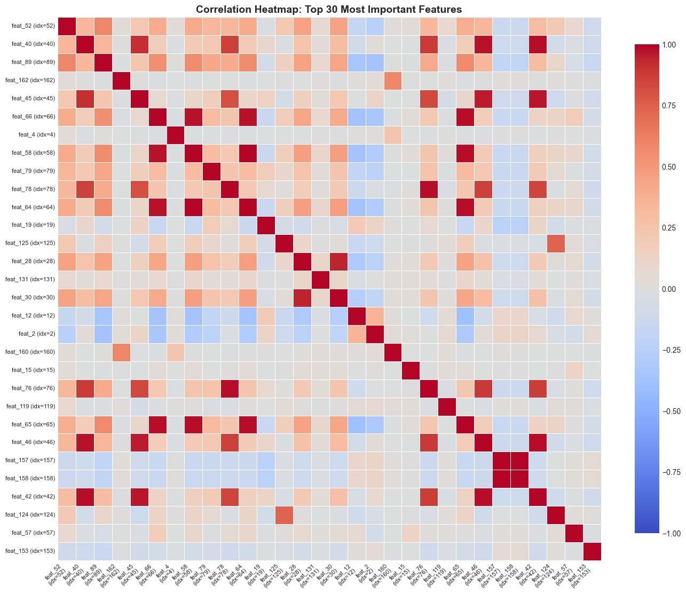

### 4\.4\. Comparison between Baseline and Reduced Feature Set

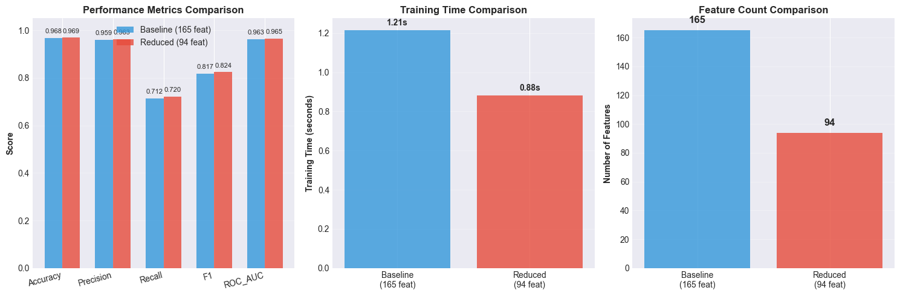

### 

## 5\. GCN with Pseudo Labelling

### 5\.1\. Validation Gating Rejecting Labels

###  

### 

### 

### 

### 5\.2\. Degradation of Performance Across Windows

### 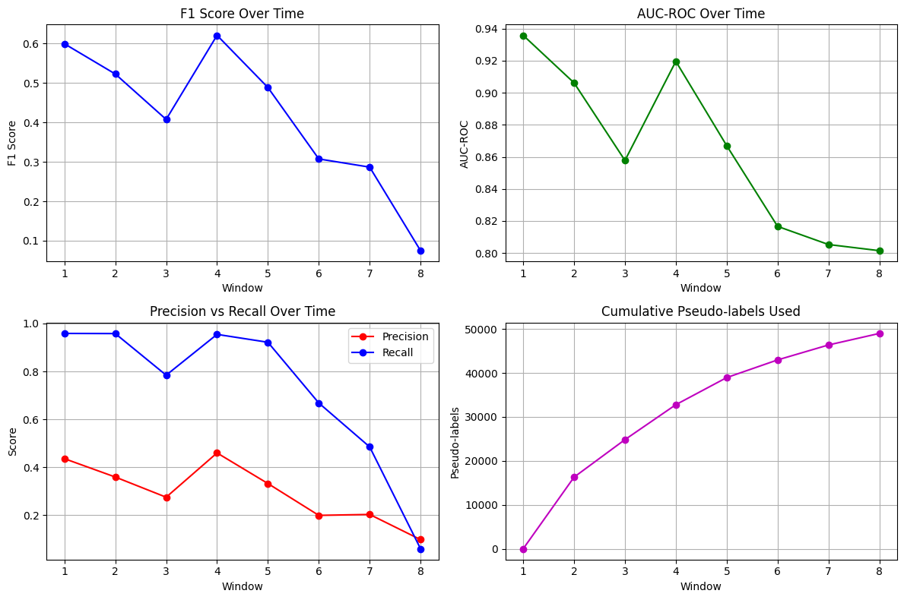

Basic PL Performance

### 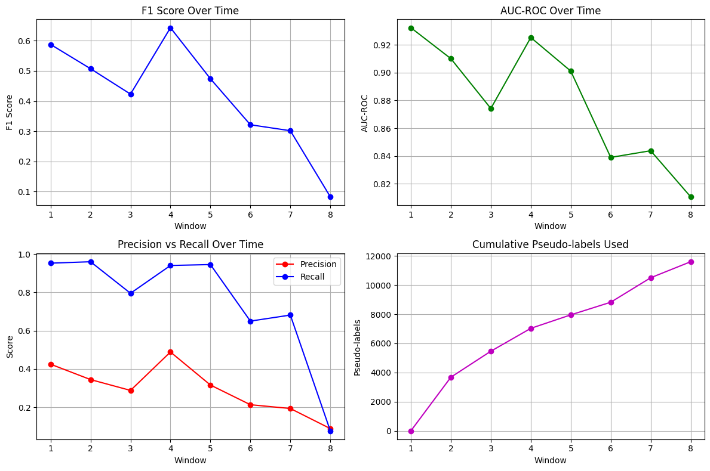

Class Maintenance PL Performance

### 

### 

###  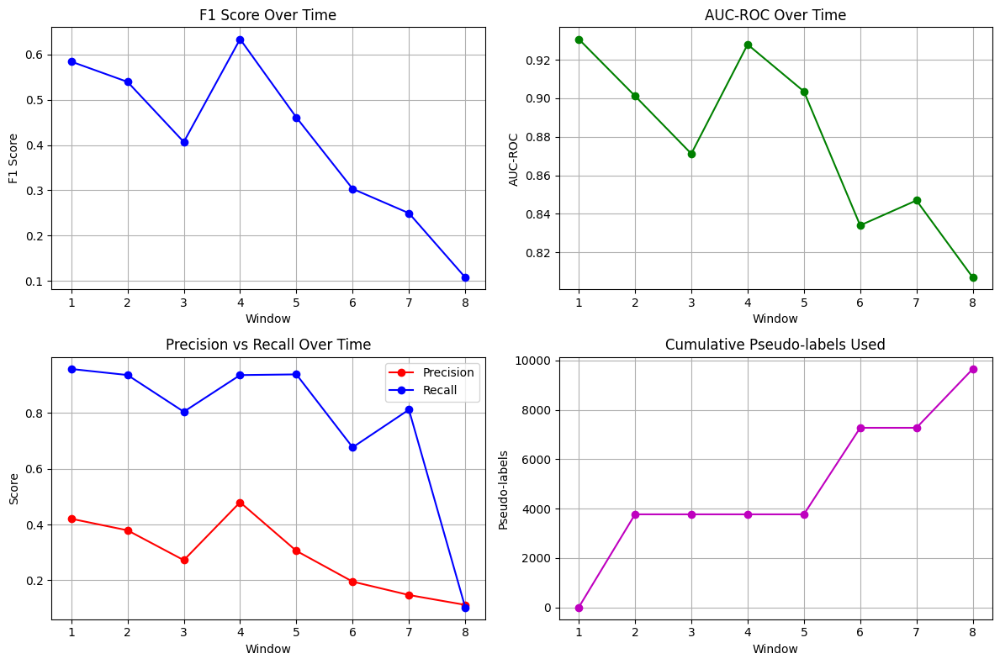

Validation Gating Performance

## 6\. XGBoost Model Training and Validation

=================================================================================

HYPERPARAMETER GRID

=================================================================================

  Total combinations: 243

  CV folds: 5

  Total trainings: 1,215

Grid details:

  reg\_alpha: \[0\.1, 1\.0, 10\.0\]

  reg\_lambda: \[0\.1, 1\.0, 10\.0\]

  max\_depth: \[4, 6, 8\]

  learning\_rate: \[0\.01, 0\.1, 0\.3\]

  subsample: \[0\.7, 0\.8, 1\.0\]

scale\_pos\_weight = \(y\_train == 0\)\.sum\(\) / \(y\_train == 1\)\.sum\(\)

Class imbalance \(scale\_pos\_weight\): 5\.82

=================================================================================

\# Base model

base\_model = xgb\.XGBClassifier\(

    scale\_pos\_weight=scale\_pos\_weight,

    random\_state=42,

    n\_estimators=100,

\)

\# 5\-fold stratified CV

cv\_strategy = StratifiedKFold\(n\_splits=5, shuffle=True, random\_state=42\)

\# GridSearchCV

grid\_search\_5fold = GridSearchCV\(

    estimator=base\_model,

    param\_grid=param\_grid,

    cv=cv\_strategy,

    scoring='f1',

    n\_jobs=2,

    verbose=2,

    return\_train\_score=True

\)

## 7\. Account Level Aggregation

### 7\.1\. List of Account Level Features

| Index | Feature Name | Description |
|-------|--------------|-------------|
| 1 | num_transactions | Total number of transactions the address participated in |
| 2 | num_as_input | Number of transactions where the address was a sender |
| 3 | num_as_output | Number of transactions where the address was a receiver |
| 4 | total_btc_sent | Cumulative Bitcoin sent by the address |
| 5 | total_btc_received | Cumulative Bitcoin received by the address |
| 6 | net_btc_flow | Net Bitcoin balance (received - sent) |
| 7 | avg_btc_per_input_tx | Average Bitcoin amount per sending transaction |
| 8 | avg_btc_per_output_tx | Average Bitcoin amount per receiving transaction |
| 9 | avg_num_inputs_per_tx | Average number of input addresses per transaction initiated |
| 10 | avg_num_outputs_per_tx | Average number of output addresses per transaction initiated |
| 11 | input_output_ratio | Ratio of inputs to outputs in transactions |
| 12 | total_fees_paid | Cumulative transaction fees paid |
| 13 | fee_to_volume_ratio | Ratio of fees to total transaction volume |
| 14 | first_timestep | First timestep when the address appeared |
| 15 | last_timestep | Last timestep when the address appeared |
| 16 | activity_duration | Number of timesteps the address was active |
| 17 | out_degree | Number of unique addresses this address sent to |
| 18 | in_degree | Number of unique addresses this address received from |
| 19 | unique_counterparties | Total number of unique addresses transacted with |

### 7\.2\. Licit vs Illicit Accounts Distribution

### 7\.3\. Licit vs Illicit Accounts Transaction Statistics

### 7\.4\. Licit vs Illicit Accounts Fees Paid

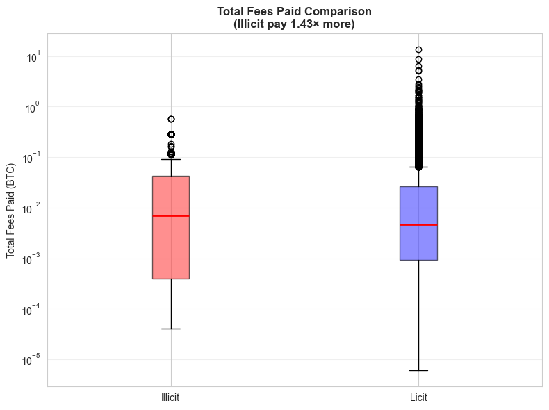

# 8\. References

Asiri, A\., Somasundaram, K\. Graph convolution network for fraud detection in bitcoin transactions\. Sci Rep 15, 11076 \(2025\)\.   
[https://doi\.org/10\.1038/s41598\-025\-95672\-w](https://doi.org/10.1038/s41598-025-95672-w)

BenZz\. \(2019, December 7\)\. Деанонимизация транзакций датасета Elliptic\. Хабр\. [https://habr\.com/ru/articles/479178/](https://habr.com/ru/articles/479178/)

Microstructuring: Challenges in AML compliance\. \(n\.d\.\)\. [https://www\.aiprise\.com/blog/microstructuring\-aml\-compliance](https://www.aiprise.com/blog/microstructuring-aml-compliance)

Sigalos, M\. \(2022, January 7\)\. Crypto scammers took a record $14 billion in 2021\. CNBC\. [https://www\.cnbc\.com/2022/01/06/crypto\-scammers\-took\-a\-record\-14\-billion\-in\-2021\-chainalysis\.html](https://www.cnbc.com/2022/01/06/crypto-scammers-took-a-record-14-billion-in-2021-chainalysis.html)  
  
Team, C\. \(2025, June 5\)\. 2025 Crypto Crime Trends: Illicit volumes portend record year as On\-Chain crime becomes increasingly diverse and professionalized\. Chainalysis\. [https://www\.chainalysis\.com/blog/2025\-crypto\-crime\-report\-introduction/](https://www.chainalysis.com/blog/2025-crypto-crime-report-introduction/)

Weber, M\., Domeniconi, G\., Chen, J\., Weidele, D\. K\., I\., Bellei, C\., Robinson, T\., & Leiserson, C\. E\. \(2019, July 31\)\. Anti\-Money Laundering in Bitcoin: Experimenting with Graph Convolutional Networks for Financial Forensics\.   
[https://arxiv\.org/abs/1908\.02591](https://arxiv.org/abs/1908.02591)

